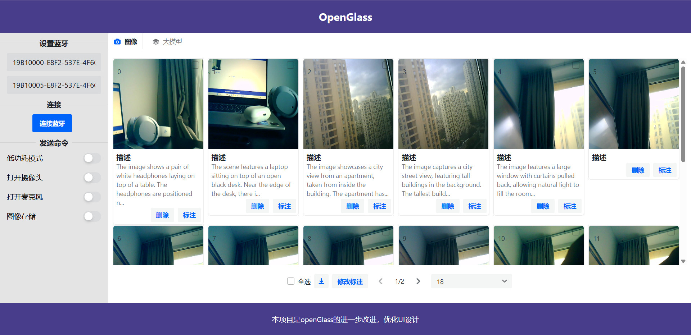
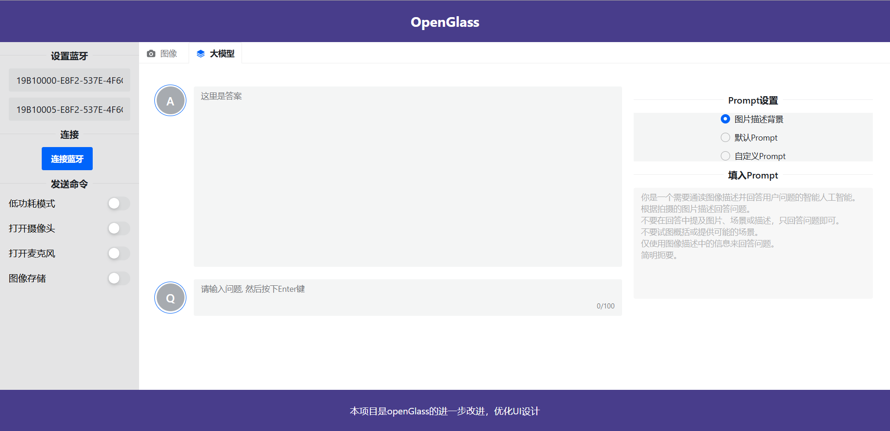
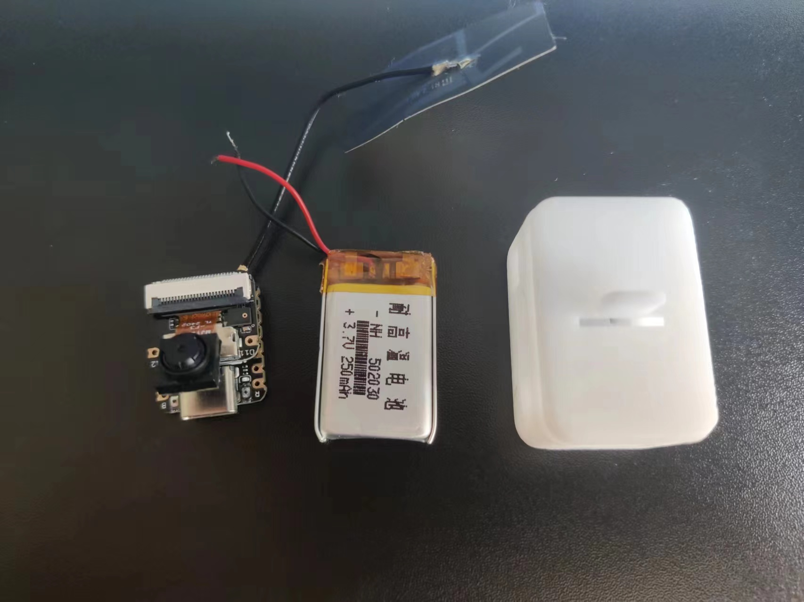
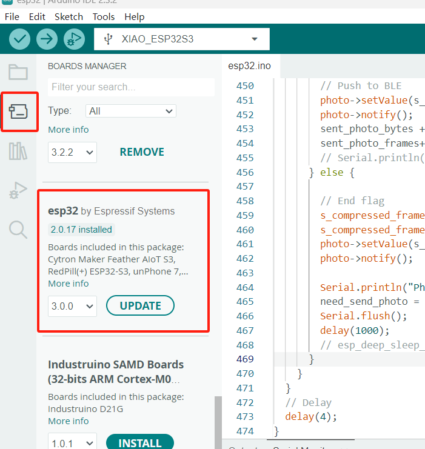

# 智能硬件—OpenCameraLLM

该项目是基于OpenGlass进行优化后开源的，地址：https://github.com/BasedHardware/OpenGlass，硬件是esp32s3 xiao, 成本为80左右。功能：可以记录你的生活、记住你见过的人、识别物体、翻译等等。另外还添加了大模型的对话窗口，可以自定义Prompt。

## 功能展示

- 拍照并将图片的描述展示，这里使用的图片识别模型只能用英文。



- 在大模型页面可以直接根据图片内容提问，或者自定义Prompt直接询问千问大模型。

  


## 硬件照片



## 环境配置

无需OpenAI接口，配置好环境后无网络也可以运行大模型。

下载开源大模型

[https://github.com/ollama/ollama](https://github.com/ollama/ollama) 在主页查看相关信息，windows下载Ollama,下载后CMD执行

```ollama run qwen```

```ollama run moondream:1.8b-v2-fp16```

千问大模型用来进行对话，同时支持中文。moondream用来做图像分析描述的，似乎不支持中文。


## 下载Arduino

- 添加ESP32包，直接添加:

  

  也可以使用下面的方法添加：

  - Navigate to File > Preferences, and fill "Additional Boards Manager URLs" with the URL: `https://raw.githubusercontent.com/espressif/arduino-esp32/gh-pages/package_esp32_index.json`
  - Navigate to Tools > Board > Boards Manager..., type the keyword `esp32` in the search box, select the latest version of `esp32`, and install it.

- 选择开发板和串口:

  - 在Arduino顶部选择串口，下拉框最下"select other board and port..."
  - 搜索 `xiao`并选择`XIAO_ESP32S3`,串口选择最大的

- 下载程序到`xiao`开发板之前，先在Tools->PSRAM->PSRAM: "OPI PSRAM"

- 将firmware路径的代码下载到XIAO ESP32S3开发板

## 硬件地址:


- [Seeed Studio XIAO ESP32 S3 Sense](https://www.amazon.com/dp/B0C69FFVHH/ref=dp_iou_view_item?ie=UTF8&psc=1)
- [EEMB LP502030 3.7v 250mAH battery](https://www.amazon.com/EEMB-Battery-Rechargeable-Lithium-Connector/dp/B08VRZTHDL)
- [3D printed glasses mount case](https://storage.googleapis.com/scott-misc/openglass_case.stl)

## 软件

1. 下载项目:
   ```
   git clone https://github.com/DFQX/openCameraLLM.git
   cd openCameraLLM
   npm install
   ```
   
5. 运行:
   ```
   npm start
   ```

   打开本地路径：
   
   http://localhost:8081/

## License

This project is licensed under the MIT License.
